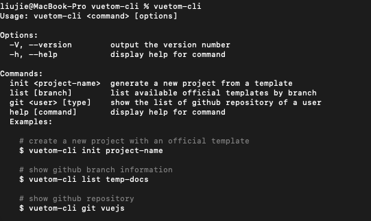
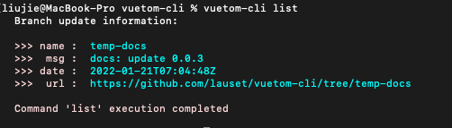
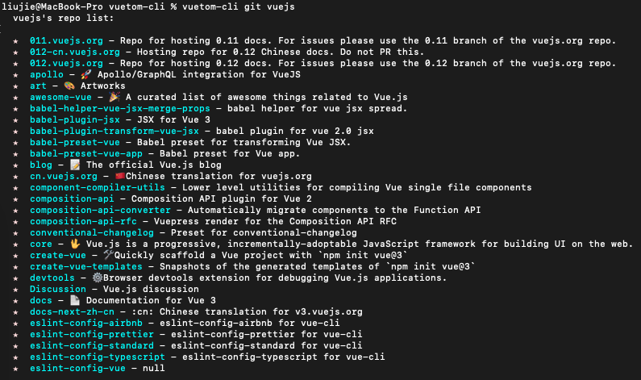
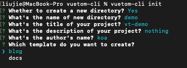
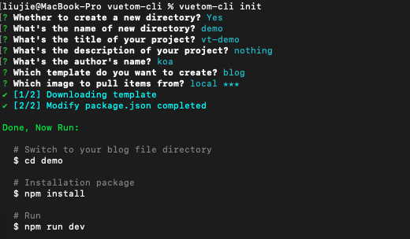

# vuetom-cli

<h1 align="center">
	<br>
	
	<br>
</h1>

> Blog & Documents generation tool

[CHANGELOG](./CHANGELOG.md)

## Links

[npm](https://www.npmjs.com/package/vuetom-cli)

[github](https://github.com/lauset/vuetom-cli)

## Install

**npm**

```bash
npm install vuetom-cli -g

# options
vuetom-cli -V
vuetom-cli --help

# init command
vuetom-cli init

# list command
vuetom-cli list temp-docs

# git command
vuetom-cli git lauset
```

**yarn**

```bash
yarn global add vuetom-cli
```

## Usage

**Options**

`-V`: View the current plug-in version number

`-h`: View the current plug-in help

**Commands**

`init`: Initialize a project with a vuetom theme

`list`: Show the latest information about the vuetom cli branch

`git`: Show the list of GIT warehouses of a user

`help`: Same as -h option

## development

```bash
# Compiling TS files
npm run tsc

# Test Cli
npm run cli

# Initialize theme project
npm run cli:init

# check dependencies updates
ncu

# update all dependencies
ncu -u
```
## showtime

`% vuetom-cli`



`% vuetom-cli list`



`% vuetom-cli git vuejs`



`% vuetom-cli init`




