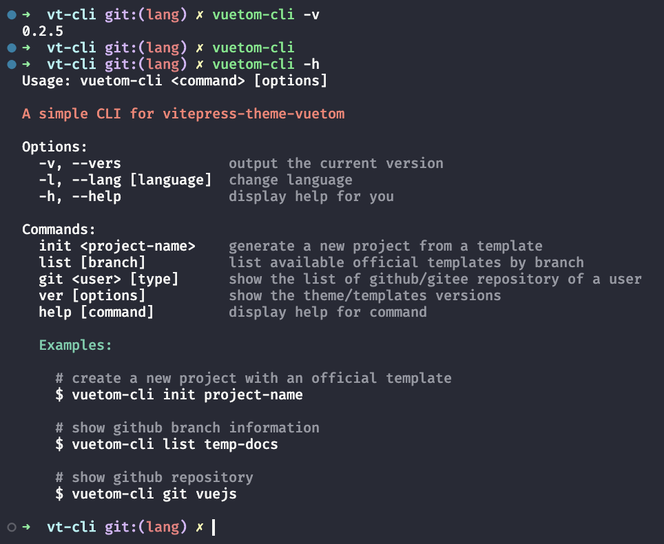
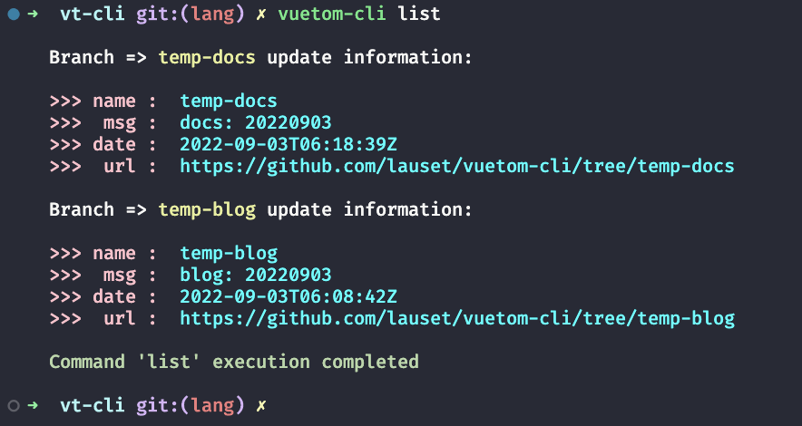
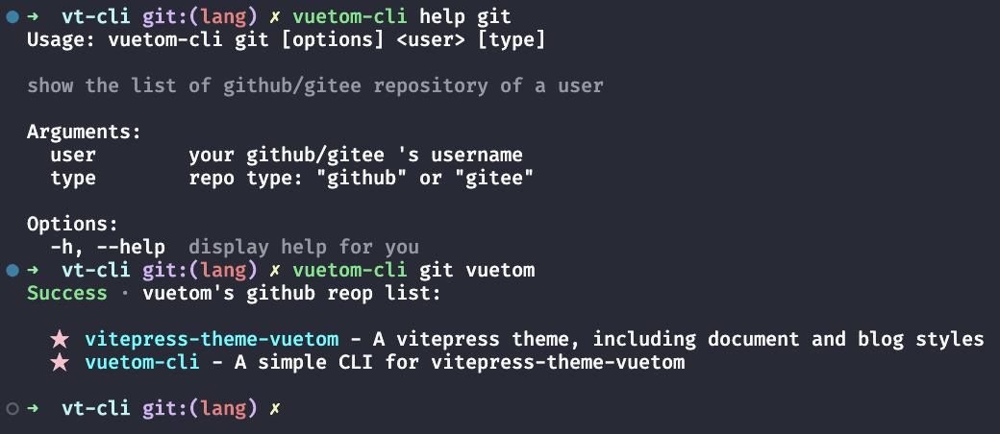
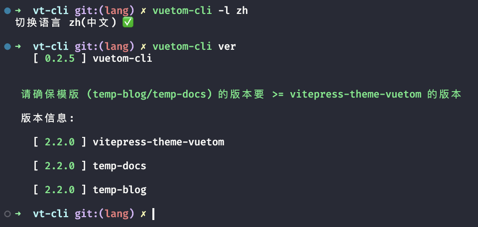

# Vuetom CLI

<h1 align="center">
 <br>
 
 <br>
</h1>

> 快速生成 `文档` 与 `博客` 主题项目

版本: 0.2.x

[English](./README.md) | 中文

[更新日志](./CHANGELOG.md)

## 链接

[npm](https://www.npmjs.com/package/vuetom-cli)

[github](https://github.com/lauset/vuetom-cli)

## 安装

**使用 npm**

```bash
npm install vuetom-cli -g

# 选项: 打印版本号
vuetom-cli -v

# 选项: 打印帮助信息
vuetom-cli --help
```

**使用 yarn**

```bash
yarn global add vuetom-cli
```

## 使用

**选项**

`-v, --vers`: 打印当前 Cli 版本号

`-h, --help`: 显示帮助信息

**命令**

`init`: 初始化一个带有 vuetom 主题的 vitepress 项目

`list`: 展示 cli 各个分支的最新提交信息

`git`: 展示某用户的 Github 或 Gitee 仓库信息

`ver`: 展示文档与博客模版的线上版本号

`help`: 用法同 -h

`-l`: 展示并修改语言

**举例：**

```bash
# 输出版本号
vuetom-cli -v

# 输出帮助信息
vuetom-cli -h

# 初始化带有主题的项目
vuetom-cli init

# 查看 temp-docs 分支的最新提交信息
vuetom-cli list
vuetom-cli list temp-docs

# 查看 lauset 的 gitee 仓库列表
vuetom-cli git lauset
vuetom-cli git lauset gitee

# 查看 docs 模版的线上版本号
vuetom-cli ver
vuetom-cli ver -t docs

# 改变命令行语言
vuetom-cli -l zh
vuetom-cli -l en # english
vuetom-cli -l    # show language
```

## 开发流程

```bash
# 安装依赖 
pnpm install

# 编译 TS 文件
pnpm build

# 测试 Cli (开发)
pnpm ts
pnpm ts:init
pnpm ts:list

# 测试 Cli (正式)
pnpm cli
pnpm cli:init
pnpm cli:list

# 检查依赖最新的版本号
ncu

# 更新依赖版本号
ncu -u
```

## 来吧展示

`% vuetom-cli`



`% vuetom-cli init`


`% vuetom-cli list`



`% vuetom-cli git`



`$ vuetom-cli ver`


